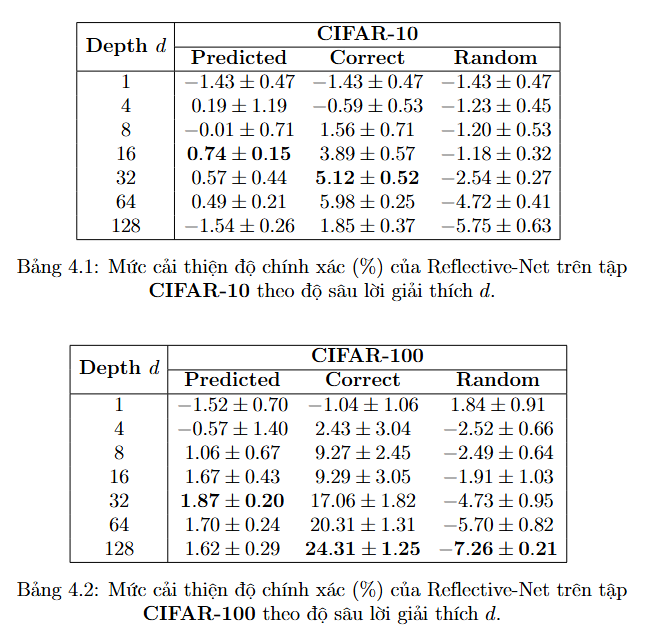

### Reflective-Net: learning from explanations

Khóa luận tốt nghiệp | Khoa Công nghệ Thông tin | Trường Đại học Khoa học Tự nhiên - ĐHQG TP.HCM

Sinh viên thực hiện:
- 21120149 : Nguyễn ĐĂNG Thới Tòan
- 21120602 : Võ Ngọc Trí

Giảng viên hướng dẫn: Lê Hoài Bắc

### Mục tiêu
Mục tiêu của khóa luận hay project này là tái hiện và đánh giá mô hình Reflective-Net, một kiến trúc CNN được mở rộng bằng cách tích hợp cơ chế giải thích (explanation) như GradCAM để hỗ trợ cho việc ra quyết định. Cụ thể, khóa luận đã đóng góp được:
- Làm rõ cơ chế hoạt động của Reflective-Net một cách trực quan và hệ thống, hỗ trợ người đọc dễ tiếp cận với một khái niệm còn mới trong cộng đồng học máy nói chung và XAI nói riêng.
- Triển khai thực nghiệm độc lập và linh hoạt, cho phép đánh giá tác động của lời giải thích đến hiệu suất mô hình thông qua nhiều kiến trúc và dữ liệu khác nhau.
- Đề xuất cấu trúc mã hóa lại theo hướng hướng đối tượng (object-oriented), hỗ trợ tái sử dụng và mở rộng mô hình trong các nghiên cứu tiếp theo.

### Mục lục

### Cấu trúc thư mục
```text
reflective-net/
├── config/                # Cấu hình để chạy và đánh giá mô hình
├── models/             
│   ├── blocks.py          # Định nghĩa các block, layer trong kiến trúc CNN
│   └── expnet.py          # Định nghĩa kiến trúc mô hình chính
├── explain/               # GradCAM và các hàm tạo saliency maps
├── utils/                 # Chứa hàm vẽ ảnh overlay, hiển thị kết quả
├── dataset_handling/      # Module chứa các hàm xử lý dữ liệu
├── classifier_handling/   # Module chứa các hàm dùng để tạo và xử lý classifier 
├── evaluate/             
│   ├── evaluate.py        # Chứa các hàm dùng để đánh giá mô hình
│   └── evaluation.ipynb   # Notebook trực quan, dùng lại các module trên
├── requirements.txt       # Các thư viện cần cài đặt
└── README.md              # Tổng quan về project và hướng dẫn sử dụng chương trình
``` 

### Cài đặt Project

Yêu cầu:
- Python 3.10 trở lên
- pip, venv
- Có GPU + CUDA để tăng tốc GradCAM

Các bước thực hiện
- Nếu bạn clone code từ github: 
```
git clone https://github.com/your-username/reflective-net.git
cd reflective-net
```
- (Tùy chọn) tạo môi trường ảo:
```
python -m venv venv
source venv/bin/activate      # hoặc venv\Scripts\activate nếu dùng Windows
```
- Cài các thư viện cần thiết:
```
pip install -r requirements.txt
```

### Chạy đánh giá
1. Chạy bằng script (local)
```
python .\evaluate\evaluate.py
```
2. Chạy bằng jupyter notebook
Nếu chạy trên máy local
```
pip install jupyter
jupyter notebook .\evaluate\evaluate.ipynb
```
Hoặc chạy trực tiếp trên [Google Colab](https://colab.research.google.com/) 

### Kết quả
1. Kết quả một run đánh giá

2. Tổng hợp kết quả khảo sát
Dưới đây là một kết quả khảo sát cho tham số độ sâu lời giải thích d trong GradCAM trên 2 tập dữ liệu Cifar-10 và Cifar-100.


### Tài liệu tham khảo
- Johannes Schneider et al. (2020) – [Reflective-Net: learning from explanations](https://arxiv.org/pdf/2011.13986)
- Selvaraju et al. (2017) – [GradCAM](https://arxiv.org/abs/1610.02391)

### Hướng phát triển tương lai
- Đảm bảo reflective net hoạt động ổn định trên các kiến trúc CNN khác nhau.
- Tích hợp phương pháp GradCAM++ để nâng cao độ sắc nét bản đồ saliency.
- Thử nghiệm các phương pháp giải thích khác để so sánh.
- Thử nghiệm trên nhiều dataset khác như ImageNet (hoặc ảnh y tế).